# qubartstudios.com 

# goal of this project
Welcome to Qubart Studios. This is a professional photographer's website. The domain of qubartstudios.com is wedding photography.

The site targets potential customers who are planning their weddings. It gives an overview of previous artwork and backs it up with strong customer testimonials.

Customers can get in touch with the studio directly by the phone, through the contact form or social media.

The main goal of the project is to give a modern look to the old website and learn along the way.

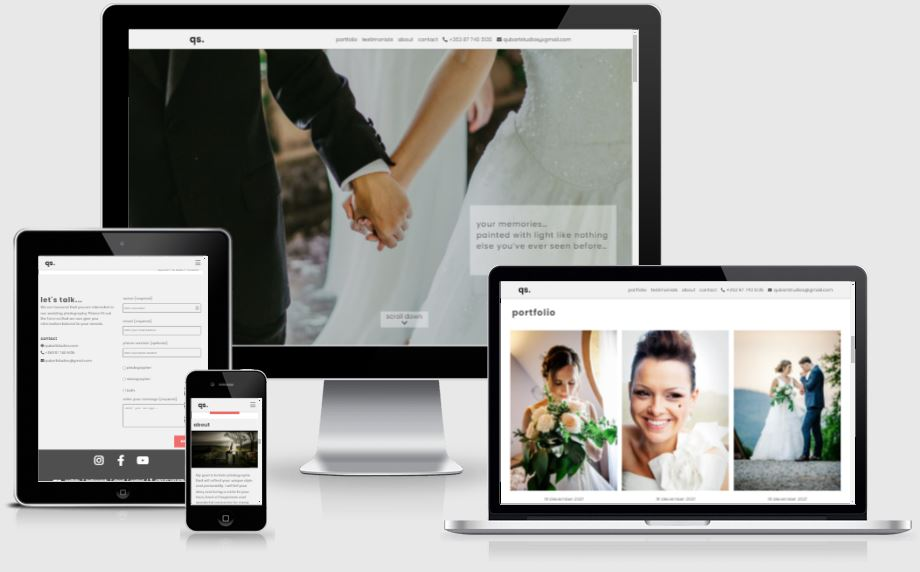

# table of contents

* [ux](#ux "ux")
    * [user goals](#user-goals "user goals")
    * [user stories](#user-stories "user stories")
    * [site owner goals](#site-owner-goals "site owner goals")
    * [user requirements and expectations](#user-requirements-and-expectations "user requirements and expectations")
         * [requirements](#requirements "requirements")
         * [expectations](#expectations "expectations")
     * [design choices](#design-choices "design choices")
        * [fonts](#fonts "fonts")
        * [icons](#icons "icons")
        * [colors](#colors "colors")        
        * [structure](#structure "structure")
    * [wireframes](#wireframes "wireframes")
    * [features](#features "features")
        * [existing features](#existing-features "existing features")
            * [navigation bar](#navigation-bar "navigation bar")
            * [home page](#home-page "home page")
            * [ethos section](#ethos-section "ethos section")
            * [portfolio section and page](#portfolio-section-and-page "portfolio section and page")
            * [about section](#about-section "about section")
            * [testimonials section](#testimonials-section "testimonials section")
            * [contact section](#contact-section "contact section")
            * [footer](#footer "footer")
        * [future developments](#future-developments "future developments")
    * [technologies used](#technologies-used "technologies used")
        * [languages](#languages "languages")
        * [libraries and frameworks](#libraries-and-frameworks "libraries and frameworks")
        * [tools](#tools "tools")
    * [testing](#testing "testing")
        * [images](#images "images")
        * [during testing](#during-testing "during teting") 
        * [unfixed bugs](#unfixed-bugs "unfixed bugs")        
    * [deployment](#deployment "deployment")
    * [credits](#credits "credits")
    
# ux

## user goals
* visually appealing, including images
* easily navigated around
* easily found contact details
* form to directly contact the company
* responsive design

## user stories
* as a user, I want to see professional artwork of the photographer
* as a user, I want to contact studio by phone
* as a user, I want to contact studio by email
* as a user, I want to contact studio through website
* as a user, I want to contact studio by facebook
* as a user, I want to contact studio by instagram
* as a user, I want to get back to home page easily
* as a user, I want to see recent artwork
* as a user, I want to see testimonials of previous customers
* as a user, I want to see basic information about the studio

## site owner goals
* modernise the existing website
* increase traffic to the website
* increase customer conversion
* optimise for organic SEO

## user requirements and expectations

### requirements
* clearly visible contact details and methods
* information about services
* visually appealing, neat and tidy design
* responsive design to accommodate modern screen sizes

### expectations
* I expect to see contact details on every page
* I expect all contact details to be correct
* I expect all links to work
* I expect all external links to open in new tabs
* I expect fast website load without loss of image quality
* I expect confirmation message on form submission
* I expect website will work on phones, tablets and laptops

\
&nbsp;
[back to top](#table-of-contents)
\
&nbsp;

## design choices

### fonts
I used [Google Fonts](https://fonts.google.com/ "Google Fonts"). The font used for the entire website is [Poppins](https://fonts.google.com/specimen/Roboto+Slab?query=rob "Poppins"). 

### icons
I used [Font Awesome library](https://fontawesome.com/ "Font Awesome") for extra visual cues.

### colors

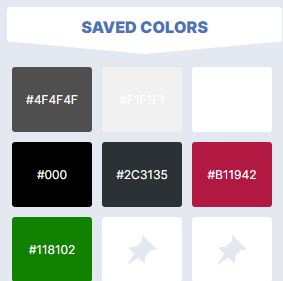
 
 * #f1f1f1; - navigation bar color
 * #f1f1f1; and #ffffff; - main background color
 * #4f4f4f; - font color
 * #b11942; - input buttons color
 * #000; and #fff; - logo colors
 * #4f4f4f; - footer color
 * #2c3135; - design by color

### structure
Website is responsive with min-size of iPhone 4 (320px - wide)
The screen size breakpoints are from [Bootstrap breakpoints](https://getbootstrap.com/docs/5.0/layout/breakpoints/ "Bootstrap").

| Screen Size | Breakpoint |
| ----------- | ---------- |
| x-small     | <576px     |
| small       | => 576px   |
| medium      | => 768px   |
| large       | => 992px   |
| x-large     | => 1200px  |

\
&nbsp;
[back to top](#table-of-contents)
\
&nbsp;

# wireframes
I use [diagrams.net](https://www.diagrams.net/ "diagrams.net") to develop wireframes for the website. 
wireframes are designed for large screen only. I used [Mozilla Firefox](https://www.mozilla.org/en-US/firefox/browsers/mobile/ "Mozilla Firefox") and [Chrome](https://www.google.com/intl/en_ie/chrome/ "Chrome") developer tools to scale down and adjust design for smaller screens.

The wireframe of pages below:

* index.html page
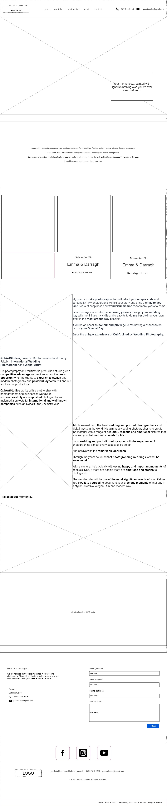 

\
&nbsp;

* portfolio.html page
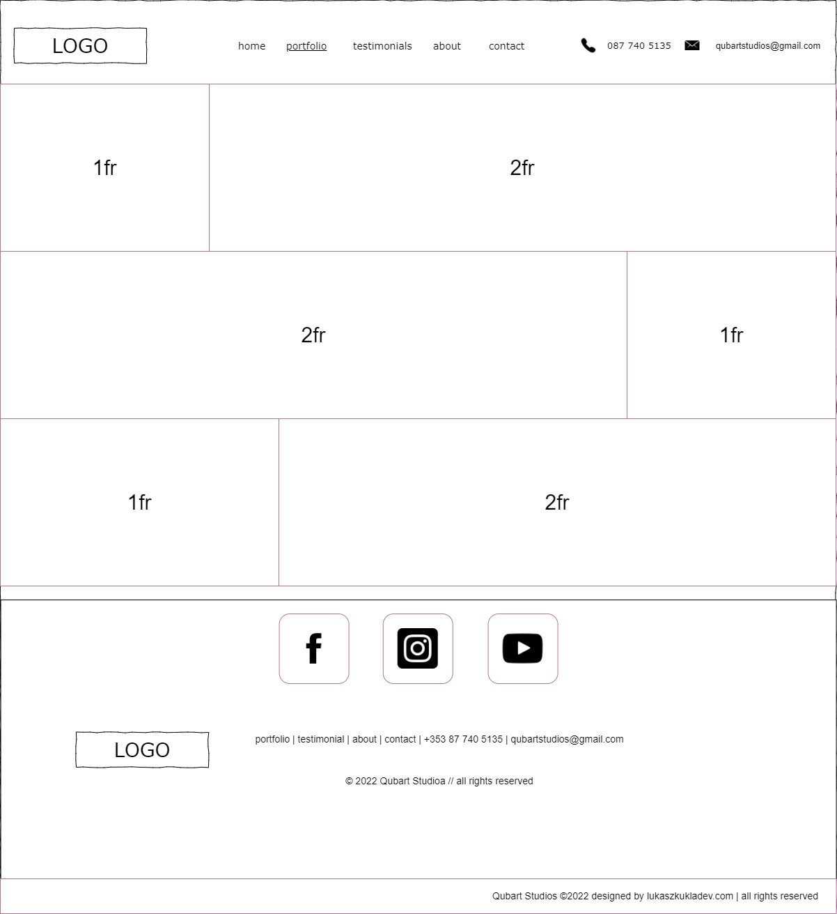 

\
&nbsp;

* mobile version of the page
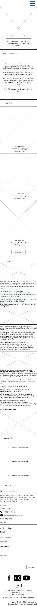

\
&nbsp;
[back to top](#table-of-contents)
\
&nbsp;

# features

## existing features

### navigation bar

Responsive navigation bar adapts to various screen sizes.
Includes **active link** for the **phone number** and **emails address**.
Each section of the page has a clear heading to inform user on whic part of the websit is currently visible. 

On smaller devices (<992px), navigation bar changes to "hamburger" style. 

### home page

* home page hero image
    - the image spans over the whole height of the screen and gives the user clear message about the intent of the website, thsi works for each screen size
    - the message over the image invites visitor to think of it as a work of art 
    - there is a "scroll down" button inviting user to explore more  

    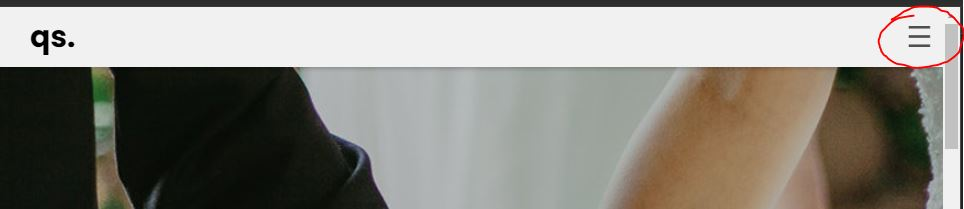

### ethos section

* the ethos section gives a brief introduction and invitation to explore further

### portfolio section and page

* the portfolio section gives quick overview of the recent or best projects chosen by the owner
* user can click each photo to view gallery of images

portfolio - index.html page
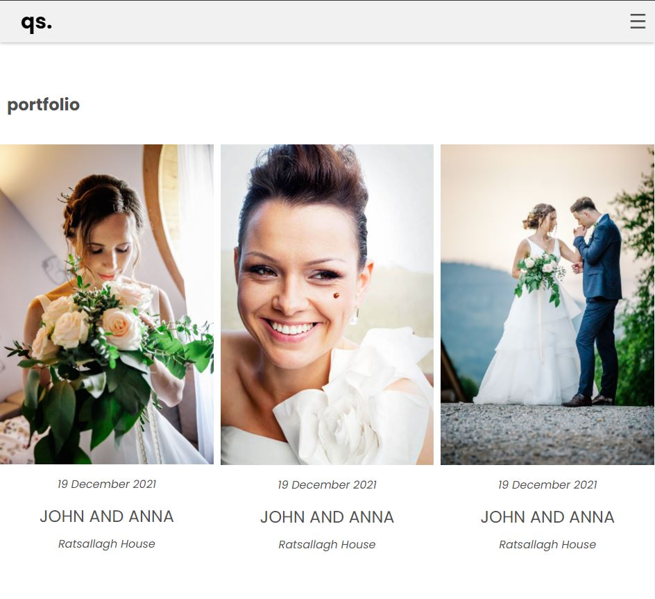

gallery of images - portfolio.html page
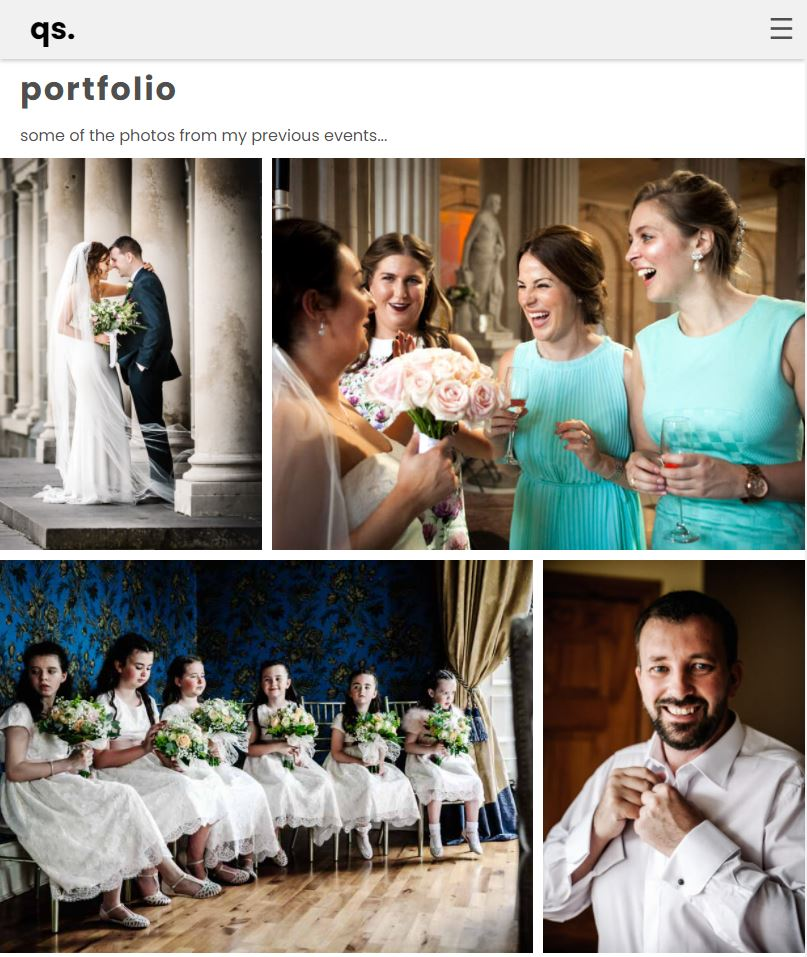

### about section

* the about section gives an information about the owner of the company, it's passion and a personal touch. Visitor can "meet" and get to "know" the owner.

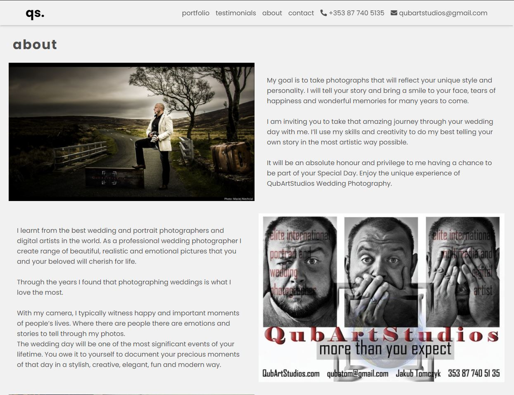

### testimonials section

* the testimonial section helps to build trust, reputation, relationship and assure the potential visitors that the qubartstuidos.com is a reliable supplier 

\
&nbsp;
[back to top](#table-of-contents)
\
&nbsp;

### contact section

* the contact section provides basic information to help visitor to get in touch with qubartstudios.com 
* name, email address and the message fields are required. Email is also validated
* all fields are labelled and include words "required" or "optional" for the accessibility purposes
* additional visual cue is provided when hover over or select any of the fields
* instant feedback is provided upon form submission in the form of thanks.html page

    \
    &nbsp;
    
    contact form
    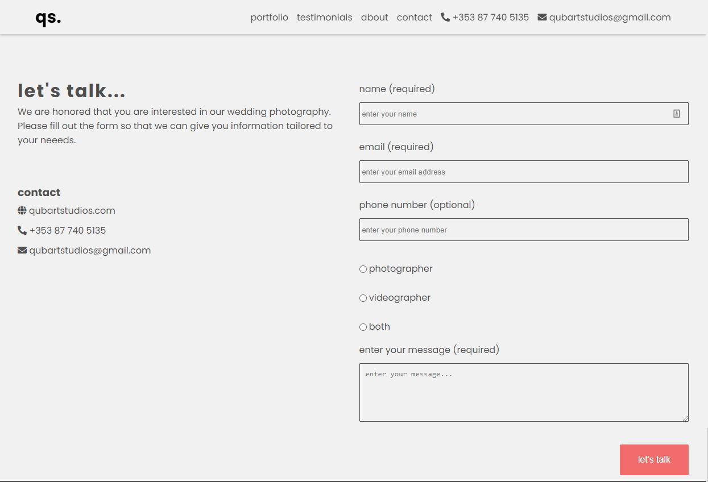

    form submission confirmation - thanks.html page
    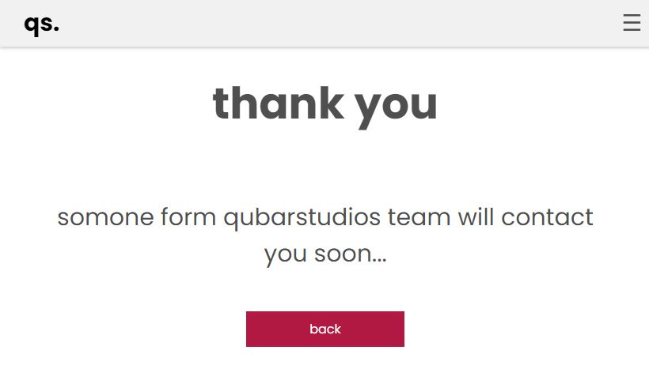
        
\
&nbsp;
[back to top](#table-of-contents)
\
&nbsp;

### Footer

* the footer contains the social media links (open in new tab)
* social media links have the hover over effect which serves as an additional visual cue
* site map
* the copyright text
* logo - acting as home page (back to top)
* information about the designer

    &nbsp;

    
    \
    &nbsp;

## future developments

* expand on portfolio gallery, each photo to represtent different wedding in the gallery and links to sub-category page with related photos 
* package pricing page
* video content gallery and with the description of services available 
* additional services:
    * anniversary photography
    * engagement photography
    * family photography
    * maternity and new born photography
* e-commerce
    * albums
    * canvases
    * large format prints
    * POS products
* blog
    * planning tips
    * recent weddings
\
&nbsp;
[back to top](#table-of-contents)
\
&nbsp;

# technologies used

## languages
* [HTML](https://en.wikipedia.org/wiki/HTML "HTML")
* [CSS](https://en.wikipedia.org/wiki/CSS "CSS")

## libraries and frameworks
* [Google Fonts](https://fonts.google.com/ "Google Fonts")
* [Font Awesome library](https://fontawesome.com/ "Font Awesome")

## tools
* [Gitpod](https://www.gitpod.io/ "Gitpod")
* [Github](https://www.github.com/ "Github")
* [diagrams.net](https://diagrams.net/ "diagrams.net")
* [W3C HTML Validation Service](https://validator.w3.org/ "W3C HTML")
* [W3C CSS Validation Service](https://jigsaw.w3.org/css-validator/ "W3C CSS")
* [autoprefixer](https://autoprefixer.github.io/ "autoprefixer")
* [lighthouse](https://developers.google.com/web/tools/lighthouse "lighthouse")
* [Pexels](https://www.pexels.com/ "Pexels")
* [WebFX](https://www.webfx.com/web-design/color-picker/F1F1F1/ "WebFX color scheme generator")
* [cdnjs.com](https://cdnjs.com/ "cdnjs.com")
* [TinyPNG](https://tinypng.com/ "TinyPNG")
* [Photoshop](https://www.adobe.com/ie/products/photoshop.html "Adobe Photoshop")
* [qubartstudios.com](https://qubartstudios.com "qubartstudios.com")

\
&nbsp;
[back to top](#table-of-contents)
\
&nbsp;

# testing

I feel that I achieved agreed goals. The site is responsive. Images were optimised for web use to load faster yet still look sharp and crips. Website is clean and simple, there is no noise to discrat the user. Each section was designed with minimalist approach. Navigation bar is sticky on all devices and on large devices upward phone number and email addres is always visible.

Contact form requires minimum information to not to overwhelm potential customer. 

Social media links are clear visible in the footer and open up in the separate tab so the user can always come back to the main website.

The biggest challenge and lesson learnt was that I designed the site for the large screen first 1200px and up. This caused a number of issues when trying to scale down.
In the end I decided to refactor the whole code for the small devices firsst and use media queris to scale up for larger devices. I added grid and flex to ensure that the pages scaled nicely. 
It was chellenging and frustrating at times but it was always fun time.

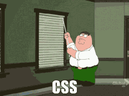

## images
All images on the webiste were compressed using [TinyPNG](https://tinypng.com/ "tinypng.com for image compression")

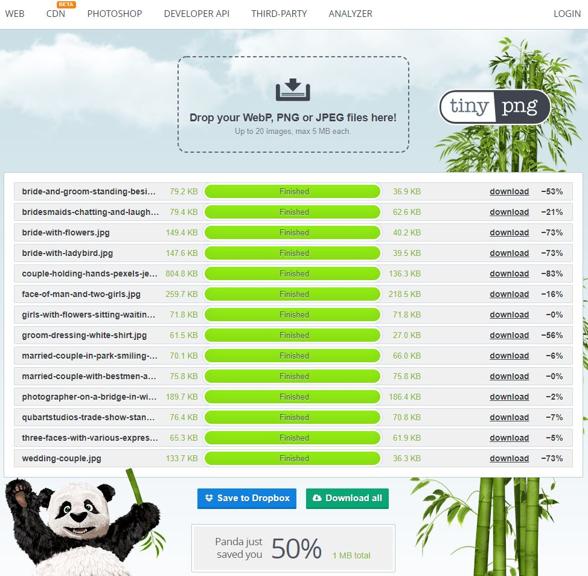

## during testing
 * Hero text was too small for devices from 576px upwards so I added media query just to deal with it
 
 * In my wireframes, I had designed about page as a separate html page. In the end I did not like idea to be directed to a different page just to see those details. I embedded it in between portfolio and testimonials section on the index.html page

 * When I switched to iPhone 4 device size my hamburger menu would disappear. I found chrome extension **[Unicorn Revealer](https://chrome.google.com/webstore/detail/unicorn-revealer/lmlkphhdlngaicolpmaakfmhplagoaln "Unicorn Revealer - helps to identify overflow items on website")** - designed actually by my mentor Simen - that helps to identify items which overflow. This tool helped me to identify the cluprit quickly and deal with it. The social media icon had padding too big for smaller screens and pushed the width of the website beyond the viewport
 
 * I had issue with the top of hero image on smaller devices. 100vh viewport was actually longer than the visible screen. After couple of trial and errors I noticed the this is caused by the navigation bar. This is where I developed image height to be a calculated figure that takes 100vh and subtracts height of the navbar of 6rem. This gives a nice full screen view of the hero image one every screen size

 * Due to change in the design strategy. I found that I had a lot of repeated code in my style.css file. It took a great deal of time to find and remove it and test to ensure that nothing I removed impacted my design

* I run my webstie through [W3C Markup Validation Service](https://validator.w3.org/ "Markup validation sevrvice"). Intial response returned 7 errors and 2 warnings (screenshot below). Second validation returned 1 minor warning

Initial Markup Test
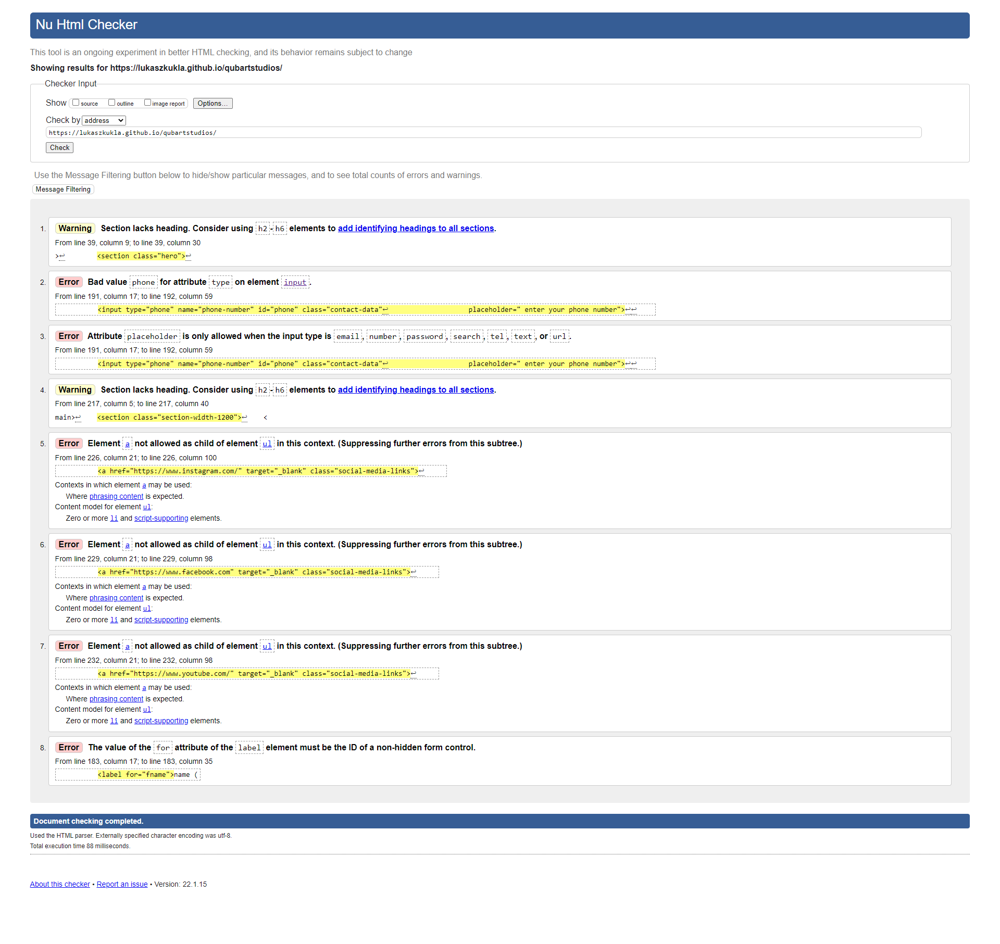

Second Markup Test
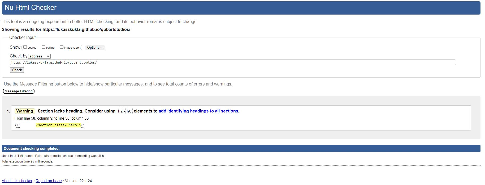

* Subsequently I ran validation of my css styles using [W3C CSS Validation Service](https://jigsaw.w3.org/css-validator/ "W3C CSS Validation Service"). Which to my surprise did not return any errors.

Initial CSS Test
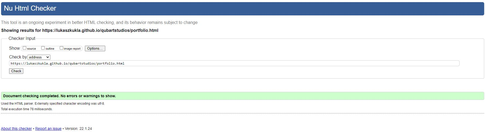

 * Accessibility test was pushed through [experte.com](https://www.experte.com/accessibility "accessibility testing"). My intial test returned just few errors. There was an issue with the aria labels around social media icon links of each page. Also contrast ratio between text of the button and actual background color was not too strong therefore I decided to give it new --maroon-shade value. Second test came up really good.

 Initail Accessibility Test
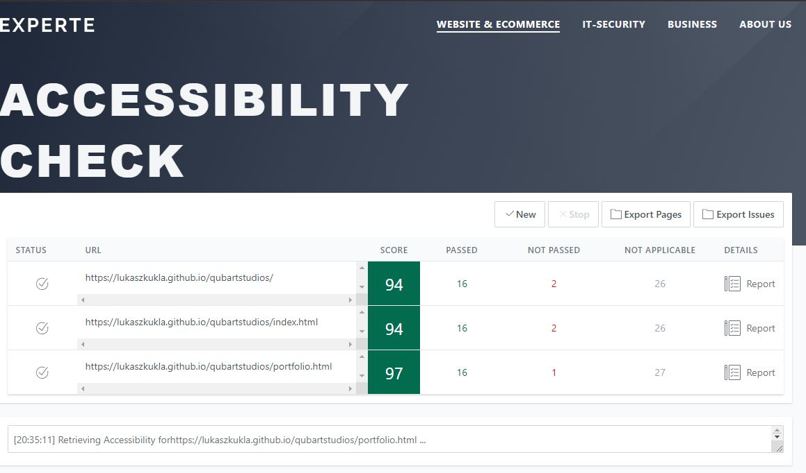

 Second Accessibility Test
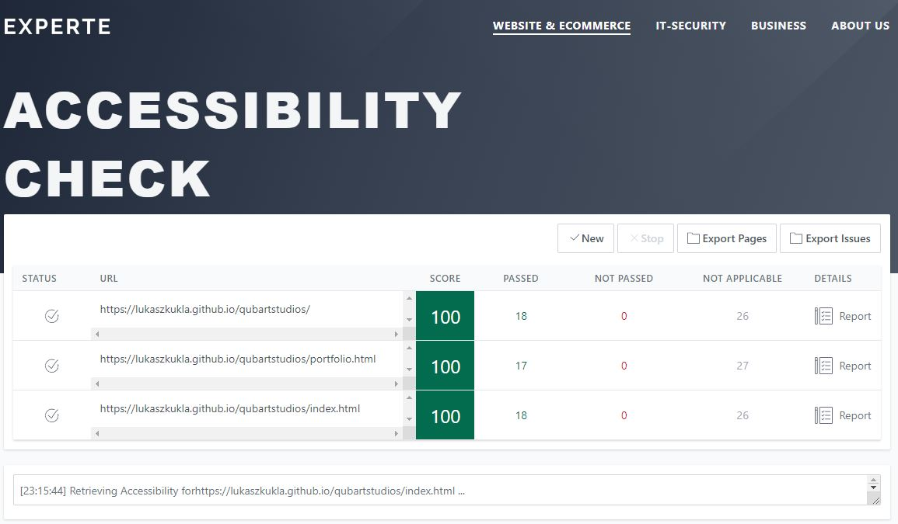

* Final testing was performed by Google's [Lighthouse](https://developers.google.com/web/tools/lighthouse "lighthouse")

desktop size version

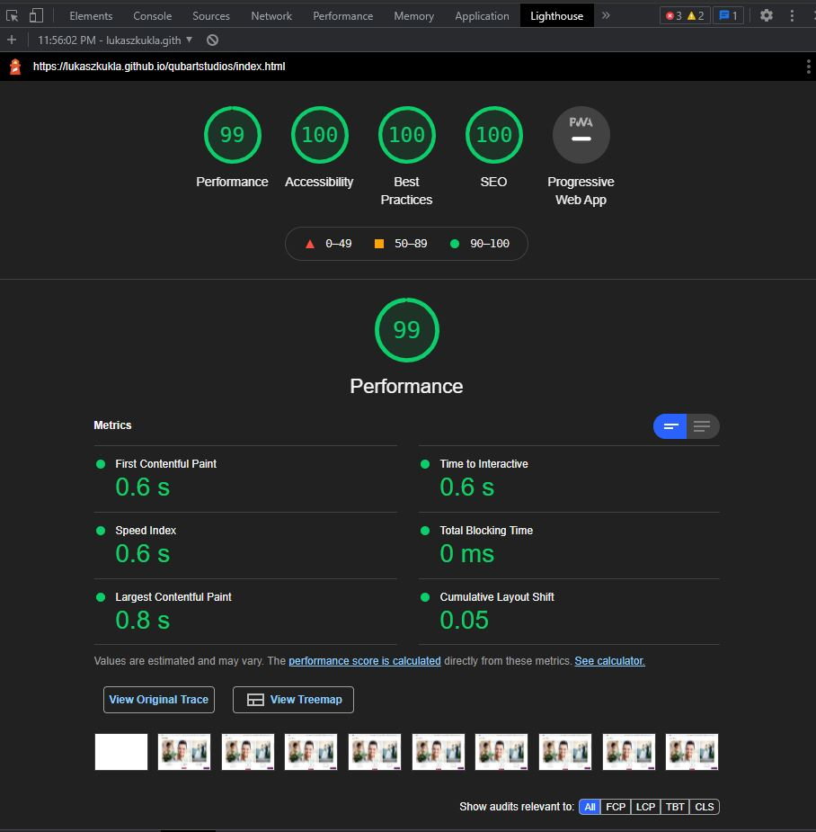

\
&nbsp;
mobile size version
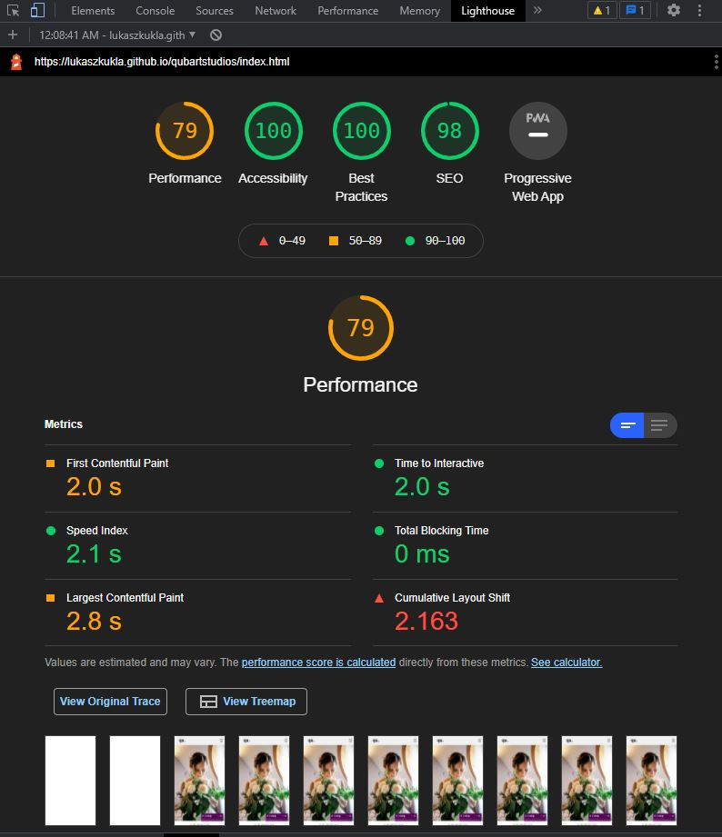

\
&nbsp;

* Website was also tested on physical mobile devices:
    * Galaxy Tab A On testing on a physical mobile devices
    * Google Pixel 4XL
    * Iphone XR
    * iPad 6th generation 2018

\
&nbsp;

* Last but not least I tested website and its responsiveness on 5 browsers:
    * [chrome](https://www.google.com/intl/en_ie/chrome/ "googel chrome browser") - used most of the time throughout the project alnog with the developer tools
    * [firefox](https://www.mozilla.org/en-US/firefox/new/?redirect_source=firefox-com "mozilla firefox browser")
    * [opera](https://www.opera.com/ "opera.com browser")
    * [vivaldi](https://vivaldi.com/ "vivalid borwser")
    * [edge](https://www.microsoft.com/en-us/edge "microsoft edge browser")

\
&nbsp;
[back to top](#table-of-contents)
\
&nbsp;

## unfixed bugs
* The mobile version of the website should have smaller image to in the place of the full desktop one. This would improve its performace.
* I come across weird issue on during my tests on Vivaldi and Firefox website. Althoug CSS code was run through [autoprefixer](https://autoprefixer.github.io/ "autoprefixer") this did not fixe the issue. The issue is with the first landscape image on the portfolio page where the image does not span to full width of the grid container when I change the width of it with the developer tools. It only happens in those 2 browsers.
* I would like to revisit the html structure, classes and ids. I am sure I could cut down on lines of code in my CSS file to make it better.
Other than that qubartstudios website needs more features mentioned in [future developments](#future-developments) section.

\
&nbsp;
[back to top](#table-of-contents)
\
&nbsp;

# deployment
The project was deployed on GitHub pages after initial commits using following process:

* Navigate to the repository on github and click 'Settings'
* Then select 'Pages' on the side navigation
* Select the 'None' dropdown, and then click 'master'
* Click on the 'Save' button.
* Now the website is now live on https://lukaszkukla.github.io/qubartstudios/
* If any changes are required, they can be done, committed and pushed to GitHub and the changes will be updated

\
&nbsp;
[back to top](#table-of-contents)
\
&nbsp;

# credits

* [Simen Daehlin](https://github.com/Eventyret "Simen Daehlin") - for code inspiration, help and advice

* [Sam Timmins](https://github.com/sam-timmins/T4Tri-triathlon-club "Sam Timmins") - for readme template, structure and some ideas that sparked from using it

* peer community on [code institute](codeinstitute.com) slack channel

* kasia_ci from [code institute](codeinstitute.com) - for "standing up" to the task and listening to the whole class weekly and patiently advising on best course of action
\
&nbsp;
[back to top](#table-of-contents)
\
&nbsp;

