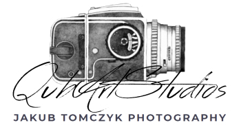
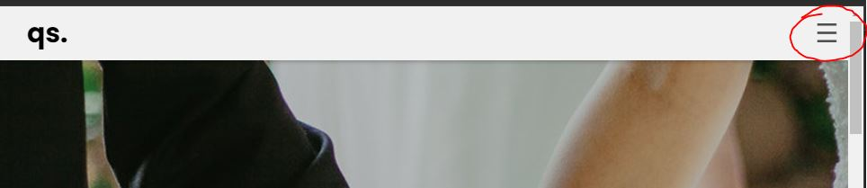
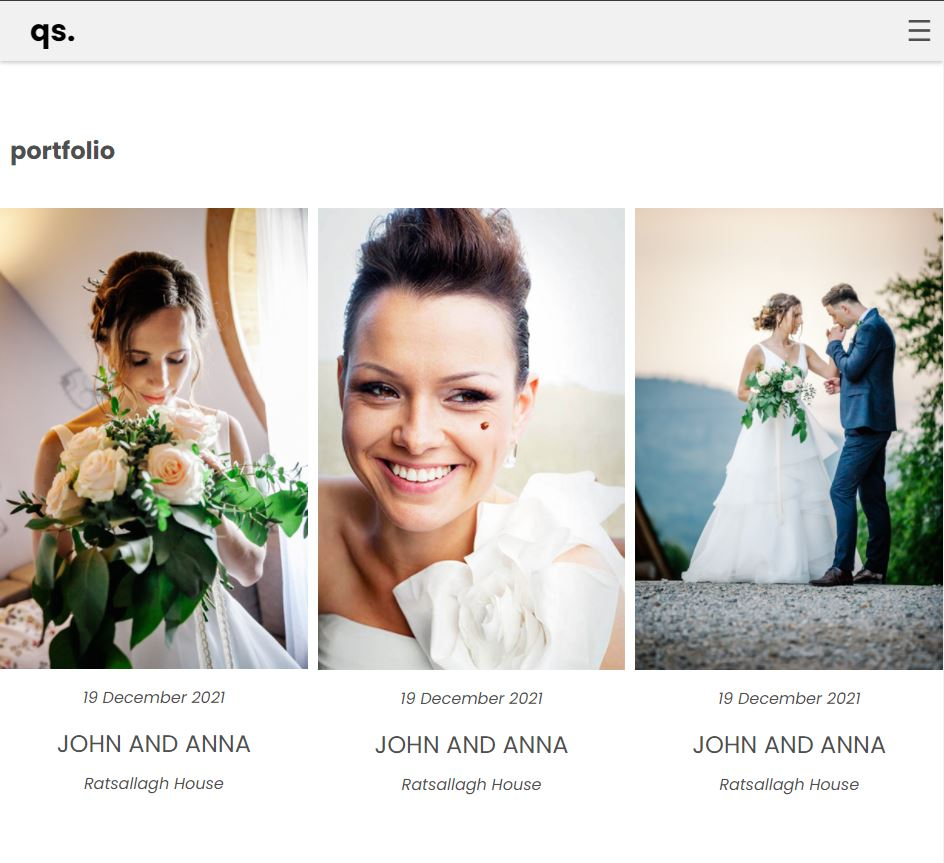
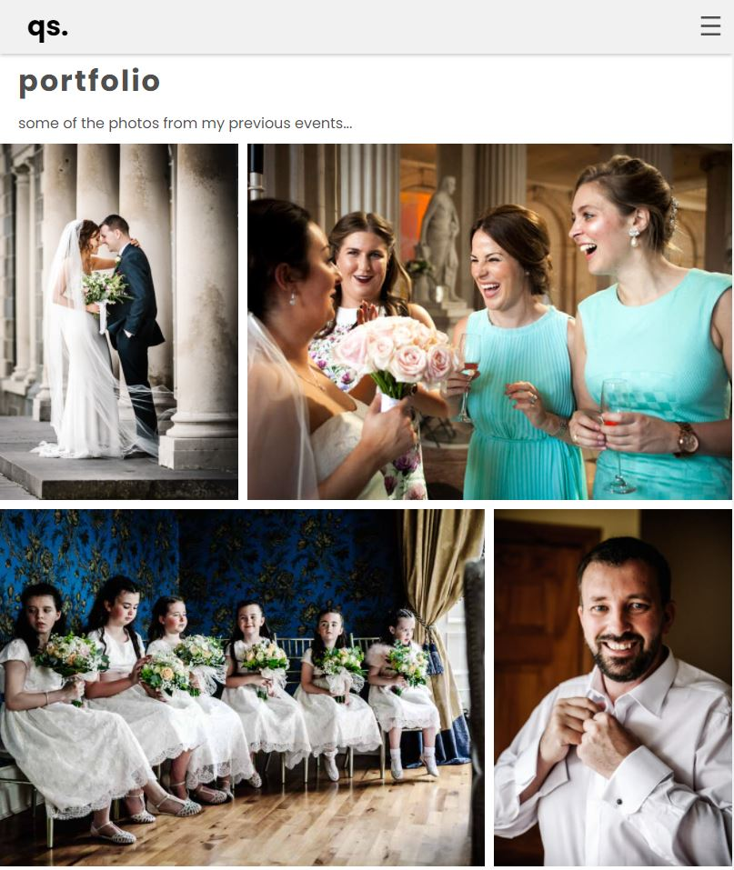
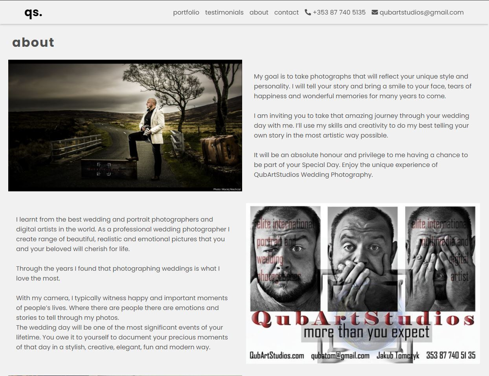
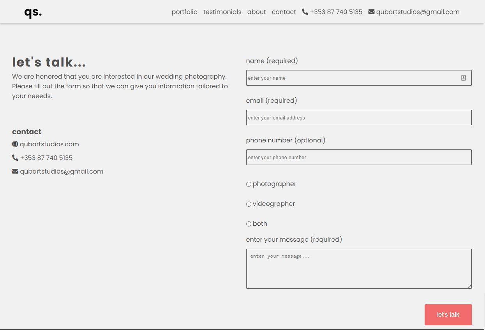
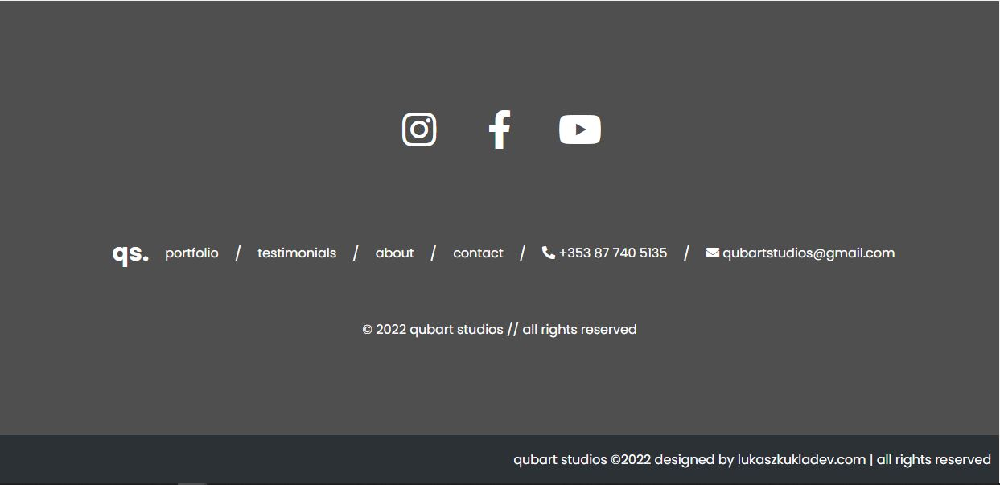

# qubartstudios.com 

# goal of this project
Welcome to Qubart Studios. This is a professional photographer's website. The domain of qubartstudios.com is wedding photography.

The site targets potential customers who are planning their weddings. It gives an overview of previous artwork and backs it up with strong customer testimonials.

Customers can get in touch with the studio directly by the phone, through the contact form or social media.

The main goal of the project is to give a modern look to the old website and learn along the way.

# table of contents

* [ux](#ux "ux")
    * [user goals](#user-goals "user goals")
    * [user stories](#user-stories "user stories")
    * [site owner goals](#site-owner-goals "site owner goals")
    * [user requirements and expectations](#user-requirements-and-expectations "user requirements and expectations")
         * [requirements](#requirements "requirements")
         * [expectations](#expectations "expectations")
     * [design choices](#design-choices "design choices")
        * [fonts](#fonts "fonts")
        * [icons](#icons "icons")
        * [colors](#colors "colors")
        * [structure](#structure "structure")
    * [wireframes](#wireframes "wireframes")
    * [features](#features "features")
        * [existing features](#existing-features "existing features")
            * [navigation bar](#navigation-bar "navigation bar")
            * [home page](#home-page "home page")
            * [ethos section](#ethos-section "ethos section")
            * [portfolio section and page](#portfolio-section-and-page "portfolio section and page")
            * [about section](#about-section "about section")
            * [testimonials section](#testimonials-section "testimonials section")
            * [contact section](#contact-section "contact section")
            * [footer](#footer "footer")
        * [future developments](#future-developments "future developments")
    * [technologies used](#technologies-used "technologies used")
        * [languages](#languages "languages")
        * [libraries and frameworks](#libraries-and-frameworks "libraries and frameworks")
        * [tools](#tools "tools")
    * [testing](#testing "testing")
        * [unfixed bugs](#unfixed-bugs "unfixed bugs")
    * [deployment](#deployment "deployment")
    * [credits](#credits "credits")
    
# ux

## user goals
* visually appealing, including images
* easily navigated around
* quality and valuable content
* easily found contact details
* form to directly contact the club

## user stories
* as a user, I want to see professional artwork of the photographer
* as a user, I want to contact studio by phone
* as a user, I want to contact studio by email
* as a user, I want to contact studio through website
* as a user, I want to contact studio by facebook
* as a user, I want to contact studio by instagram
* as a user, I want to get back to home page easily
* as a user, I want to see recent artwork
* as a user, I want to see testimonials of previous customers
* as a user, I want to see basic information about the studio

## site owner goals
* modernise the existing website
* increase traffic to the website
* increase customer conversion
* optimise organic SEO

## user requirements and expectations

### requirements
* clearly visible contact details and methods
* information about services
* visually appealing, neat and tidy design
* responsive design to accommodate modern screen sizes

### expectations
* I expect to see contact details on every page
* I expect all contact details to be correct
* I expect all links to work
* I expect all external links to open in new tabs
* I expect fast website load without loss of image quality
* I expect confirmation message on form submission
* I expect website will work on phones, tablets and laptops

\
&nbsp;
[back to top](#table-of-contents)
\
&nbsp;

## design choices

### fonts
I used [Google Fonts](https://fonts.google.com/ "Google Fonts"). The main text is [Noto Sans](https://fonts.googleapis.com/css2?family=Noto+Sans&display=swap "Noto Sans"). [Poppins](https://fonts.google.com/specimen/Roboto+Slab?query=rob "Poppins") is used for the headers and the navigation bar. 

### icons
I used [Font Awesome library](https://fontawesome.com/ "Font Awesome") for extra visual cues.

### colors


 
 * #fff - navigation bar color
 * #fbfbfb - main background color
 * #000 - font color
 * #3d8bca - input buttons color

### structure
Website is responsive with min-size of iPhone 4 (320px)
The screen size breakpoints are from [Bootstrap breakpoints](https://getbootstrap.com/docs/5.0/layout/breakpoints/ "Bootstrap").

| Screen Size | Breakpoint |
| ----------- | ---------- |
| x-small     | <576px     |
| small       | => 576px   |
| medium      | => 768px   |
| large       | => 992px   |
| x-large     | => 1200px  |

\
&nbsp;
[back to top](#table-of-contents)
\
&nbsp;

# wireframes
I use [diagrams.net](https://www.diagrams.net/ "diagrams.net") to develop wireframes for the website. 
wireframes are designed for large screen only. I used [Mozilla Firefox](https://www.mozilla.org/en-US/firefox/browsers/mobile/ "Mozilla Firefox") and [Chrome](https://www.google.com/intl/en_ie/chrome/ "Chrome") developer tools to scale down and adjust design for smaller screens.

The wireframe of pages below:

[home page](assets/wireframes/home.png "home wireframe")

[portfolio page](assets/wireframes/portfolio.png "portfolio wireframe")

[about page](assets/wireframes/about.png "about wireframe")

\
&nbsp;
[back to top](#table-of-contents)
\
&nbsp;

# features

## existing features

### navigation bar

Responsive navigation bar to allows for various screen sizes.
Includes **active link** for the **phone number** and **emails address**.
There is a visual cue to inform user on which section or page is currently visible. 

On smaller devices (<992px), navigation bar changes to "hamburger" style. 

### home page

* home page image
    - the image spans almost over the whole height of the screen and gives the user clear message about the intent of the website
    - the message over the image invites visitor to think of it as a work of art   

    

### ethos section

* the ethos section gives a brief introduction and invitation to explore further.

### portfolio section and page

* the portfolio section gives quick overview of the recent or best projects chosen by the owner
* user can click each phtot to view gallery of images




### about section

* the about section gives an information about the owner of the company, it's passion and a personal touch. Visitor can "meet" and get to "know" the owner.



### testimonials section

* the testimonial section helps to build trust, reputation, relationship and assure the potential visitors that the qubartstuidos.com is a reliable supplier 

\
&nbsp;
[back to top](#table-of-contents)
\
&nbsp;

### contact section

* the contact section provides basic information to help visitor to get in touch with qubartstudios.com 
   
* name, email address and the message fields are required. Email is also validated
* all fields are labelled and include words "required" or "optional" for the accessibility purposes
* additional visual cue is provided when hover over or select any of the fields
* instant feedback is provided upon form submission

    \
    &nbsp;
    \
    

    
        
\
&nbsp;
[back to top](#table-of-contents)
\
&nbsp;

### Footer

* the footer contains the social media links (open in new tab)
* social media links have the hover over effect which serves as an additional visual cue
* site map
* the copyright text
* logo - acting as home page (back to top)
* information about the designer

    &nbsp;

    
    \
    &nbsp;


## future developments

* package pricing page
* video content gallery
* expand on portfolio galleries 
* additional services:
    * anniversary photography
    * engagement photography
    * family photography
    * maternity and new born photography
* e-commerce
    * albums
    * canvases
    * large format prints
    * POS products
* blog
    * planning tips
    * recent weddings
\
&nbsp;
[back to top](#table-of-contents)
\
&nbsp;

# technologies used

## languages
* [HTML](https://en.wikipedia.org/wiki/HTML "HTML")
* [CSS](https://en.wikipedia.org/wiki/CSS "CSS")

## libraries and frameworks
* [Google Fonts](https://fonts.google.com/ "Google Fonts")
* [Font Awesome library](https://fontawesome.com/ "Font Awesome")
## tools
* [Gitpod](https://www.gitpod.io/ "Gitpod")
* [Github](https://www.github.com/ "Github")
* [diagrams.net](https://diagrams.net/ "diagrams.net")
* [W3C HTML Validation Service](https://validator.w3.org/ "W3C HTML")
* [W3C CSS Validation Service](https://jigsaw.w3.org/css-validator/ "W3C CSS")
* [Bootstrap](https://getbootstrap.com "Bootstrap")
* [Font Awesome library](https://fontawesome.com/ "Font Awesome")
* [Google Fonts](https://fonts.google.com/ "Google Fonts")
* [Pexels](https://www.pexels.com/ "Pexels")
* [Unsplash](https://unsplash.com/ "Unsplash") ****
* [Box Shadow Generator](https://html-css-js.com/css/generator/box-shadow/ "html-css-js.com") ****
* [TinyPNG](https://tinypng.com/ "TinyPNG")
* [Photoshop](https://www.adobe.com/ie/products/photoshop.html "Adobe Photoshop")
* [qubartstudios.com](https://qubartstudios.com "qubartstudios.com")

\
&nbsp;
[back to top](#table-of-contents)
\
&nbsp;

# testing

I feel that I achieved agreed goals. The site is responsive. Images were optimised for web use to load faster yet still look sharp and crips. Website is clean and simple, there is no noise to discrat the user. Each section was designed with minimalist approach. Navigation bar is sticky on all devices and on large devices upward phone number and email addres is always visible.

Contact form requires minimum information to not to overwhelm potential customer. 

Social media links are clear visible in the footer and open up in the separate tab so the user can always come back to the main website.

\
&nbsp;


The biggest challenge and lesson learnt was that I designed the site for the large screen first 1200px and up. This caused a number of issues when trying to scale down.
In the end I decided to refactor the whole code for the small devices firsst and use media queris to scale up for larger devices. I added grid and flex to ensure that the pages scaled nicely. 
It was chellenging and frustrating at times but it was always fun time.


During testing
 * Hero text was too smal for devices from 568 upwards so I added media query just to deal with it
 
 * ~~In my wireframes, I had designed to only have a 'Join Us' button on the larger screen sizes. While I was developing the site, this did not make sense. There was such a long scroll with it being a one-page site, I felt I needed to speed up the movement for someone who was instantly interested so included it on all screen sizes.~~

 * ~~On actual smaller devices, instead of on Chrome Developer, the main navigation menu did not show the 'Contact' link. I simply changed the styling of the links and the changed the ul to flex-start and all is now clearly visible.~~

 * ~~I was having issues with the navigation bar scrolling about 15px when I scrolled down on smaller devices whilst working on Chrome Developer. I lost a lot of time trying to figure out the issue, but when I tried the site on an acual device, the navigation bar stayed fixed as the code dictated. This was a bug in Chrome Developer and not with my site.~~

 * ~~The main navigation on smaller devices was initially set to 90vh, however on testing on a physical device, the user could see the site scrolling at the bottom if they were to slide up or down. This looked very poor and clumsy on the eye, so I adjusted it to 100vh to cover it up.~~

 * ~~I found that I was repeating a lot of code in my style.css file in order to center items. I created a class to do this and then applied it whee needed.~~

 * ~~All my buttons were styled completely differently. I added an animation to all buttons so there is a continuity between them all.~~

 * ~~When I was validating HTML code, I had one error showing. This was in the contact form where I had a method of '#'. I was under the understanding that POST method should have been used, but when I did, it caused an error instead of going to my contact.html page. After a while I tried using GET and it worked solving my validation problem. The results of my validation for HTML and CSS are below.~~

    - HTML (index.html) validator [results](wireframes/html-validate.jpg "W3C HTML")
    - HTML (contact.html) validator [results](wireframes/html-contact-validate.jpg "W3C HTML")
    - CSS validator [results](wireframes/css-validate.jpg "W3C CSS")
\
&nbsp;

 ~~On testing on a physical mobile device, I thought that the google search bar looked odd, being white and my header a dark color. For user experiance and to make it look cleaner and more fluid, I changed the color to match using the following code.~~

 ```

 <meta name="theme-color" content="#121A18">


 ```

 * ~~When going through my UX section, to ensure that all my goals were met for the project, I noticed that I had missed one, 'As a user, I want to know that the club is well established'. I adjusted the text in the welcome section to suit.~~
\
&nbsp;

## unfixed bugs

~~My learning has limited my use of the hamburger for smaller devices. It works nicely to open the menu up, but a tap of the hamburger again should close the menu down again. It does not do this, and the link has to be selected to enable the user to exit out of it. From my research it seems that all the streamline methods are using JavaScript and I am yet to learn this.~~


\
&nbsp;
[back to top](#table-of-contents)
\
&nbsp;

# deployment

Following writing the code then committing and pushing to GitHub, this project was deployed using GitHub by the following steps.

* Navigate to the repository on github and click 'Settings'
* Then select 'Pages' on the side navigation
* Select the 'None' dropdown, and then click 'master'
* Click on the 'Save' button.
* Now the website is now live on https://lukaszkukla.github.io/qubartstudios/
* If any changes are required, they can be done, committed and pushed to GitHub and the changes will be updated

\
&nbsp;
[back to top](#table-of-contents)
\
&nbsp;

# credits

for code inspiration, help and advice,
* [Simen Daehlin](https://github.com/Eventyret "Simen Daehlin")


* ~~[Mark Caron](https://medium.com/@heyoka/responsive-pure-css-off-canvas-hamburger-menu-aebc8d11d793 "Marc Caron")~~ ***
\
&nbsp;

for readme template, structure and some ideas from them
* [Sam Timmins](https://github.com/sam-timmins/T4Tri-triathlon-club "Sam Timmins")

\
&nbsp;
[back to top](#table-of-contents)
\
&nbsp;

